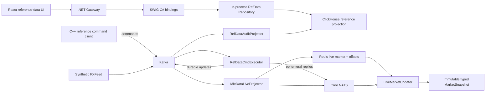
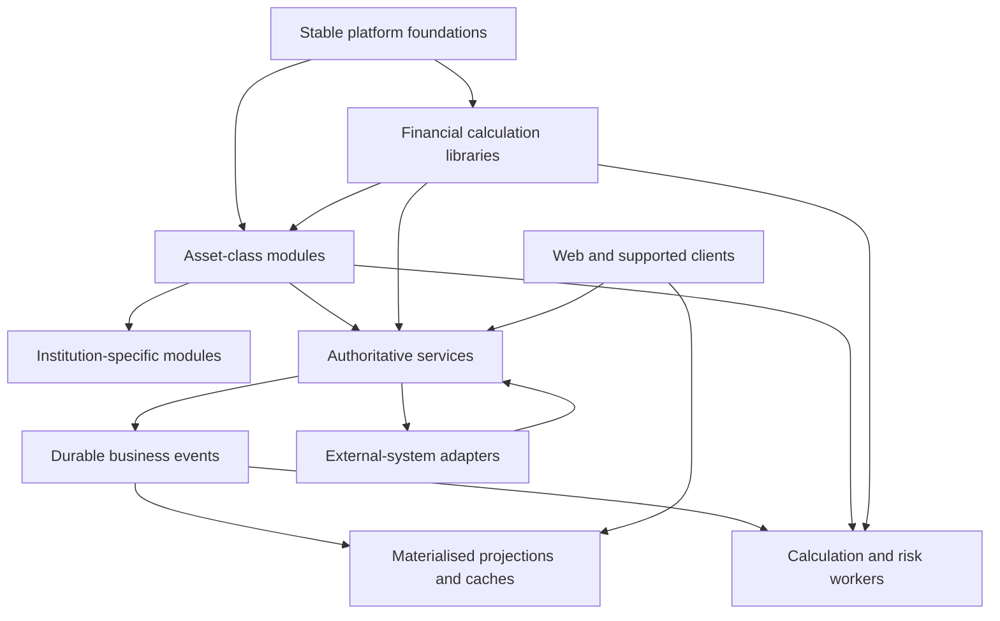
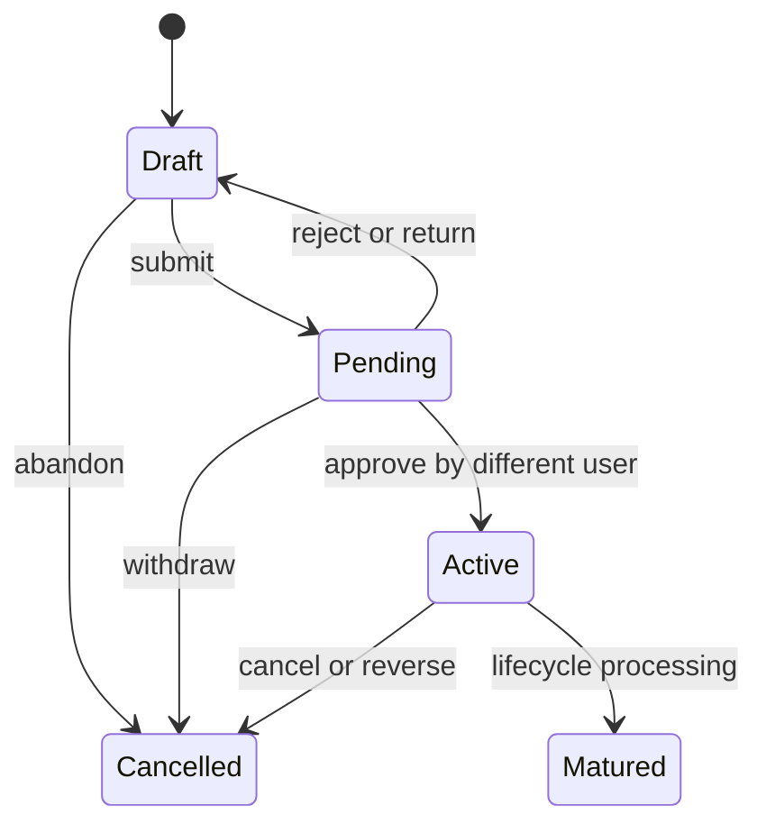

# ARQ architecture

This document records the agreed architectural direction and the current implementation shape. It is intentionally concise. The [product vision](docs/product/vision.md) defines why ARQ exists; the [roadmap](docs/roadmap/roadmap.md) defines the order in which the target will be built.

## Architectural position

ARQ should be a modular, strongly typed platform with central services owning authoritative business workflows and reusable in-process libraries performing deterministic financial calculations. It is not intended to be a pure microservice system or an independently installable financial-plugin host.

Customer distributions may be compiled from a selected set of platform, asset-class and institution modules. This is preferable to sacrificing type safety for recompilation-free extensibility.

## Current implementation

ARQ currently implements reference-data and market-data foundations:



Implemented financial types are currently limited to Currency/User reference data and FXRate/EQPrice market data. There are no implemented trades, positions, P&L, financial pricers, risk measures, quote workflows or execution workflows.

### Current state ownership

| Area | Current authority/projection |
|---|---|
| Reference-data commands | Kafka command topics consumed by `RefDataCmdExecutor` |
| Accepted reference state | Kafka reference update log; executor hydrates OCC state from it |
| Reference history/read view | ClickHouse append-only projection; gateway caches latest active records |
| Market input | Kafka compacted per-type update topics |
| Current market | Redis rebuildable projection plus stored source offsets |
| In-process market | Immutable typed snapshot built from Redis baseline and NATS updates |
| Market history | ClickHouse adapter/schema exist, but no complete durable market-history projector exists |

Known correctness and architectural defects are tracked as immediate work in the roadmap rather than being presented here as intended behaviour.

## Target boundaries



### Stable platform foundations

Own IDs, temporal primitives, event envelopes, serialization policy, configuration, logging, observability, messaging interfaces and service hosting. They must not own asset-specific types or factories.

### Financial calculation libraries

Provide deterministic C++ implementations of calendars, schedules, cashflows, curves, surfaces, product valuation and risk operations. They operate locally on explicit immutable inputs and do not make network calls.

### Asset-class modules

Contribute typed products, lifecycle validation, required market/reference types, pricers, risk calculations, schemas and optional service/UI integration. Initial module: FX spot and forwards.

### Generated domain types and schemas

Canonical definitions generate language types, Protobuf schemas, serializers, migration artifacts, compatibility checks and appropriate client metadata. Persisted field identities are explicit and permanent. Semantic incompatibilities require a new schema version and explicit upcasting.

### Authoritative services

Own commands, validation, concurrency and lifecycle for reference data, trades and other business aggregates. Accepted changes produce durable facts. ARQ is the trade system of record.

### Projections and caches

Redis, ClickHouse, web query models and in-memory caches are derived views. They must be rebuildable and expose their source watermark. They do not independently decide business state.

### Calculation and risk workers

Use the same financial libraries as interactive calculation paths but consume explicit trade/position, reference, market and model versions. They record complete calculation lineage.

### Institution extensions and external adapters

Institution code is normally compiled against supported public module APIs. Feed, venue, external trade and downstream booking adapters remain outside authoritative financial-domain implementations.

## Communication responsibilities

| Mechanism | Use |
|---|---|
| Local in-process call | Discount factors, FX conversion, interpolation, cashflows, PV and trade-level risk |
| Central synchronous service call | Trade submission/amendment/cancellation, approval, reference mutation and other authoritative commands |
| Durable asynchronous event | Accepted trades, lifecycle transitions, executions, reference changes and official corrections |
| Ephemeral message | Screen updates, cache notifications, quote indications and progress updates |
| Batch job | EOD valuation, historical reruns, large scenarios and reconciliation |
| Cached projection | Blotters, current positions, dashboards, current market and latest risk |

Kafka carries durable facts and replayable update streams. NATS carries ephemeral low-latency fan-out. Redis carries rebuildable current-state projections. A missed NATS message must be recoverable by reading current state or replaying the durable source.

## Temporal and reproducibility model

ARQ must distinguish:

- Business-effective time: when a fact is true financially.
- Source time: when the external source produced it.
- Recorded/ingestion time: when ARQ learned it.
- Processing time: when a particular service handled it.

Backdated corrections create new recorded versions with past effective times. They do not rewrite history. Historical queries must eventually support both:

- The state known at a historical recorded time.
- The latest corrected view of a historical effective time.

An EOD market can retain the same business as-of time while receiving a new immutable snapshot revision. Every official calculation must record its trade/position version, reference snapshot, market snapshot/revision and model/configuration version.

Live and EOD calculations share financial types and pricers but use different orchestration paths: live snapshots support incremental interactive calculation; EOD seals explicit input cuts and runs coordinated batch work.

## Trade and position direction

The initial lifecycle is:



Trades use optimistic aggregate versions. Material amendments to active trades create a new version and may require reapproval. Positions are deterministic projections of active trades and lifecycle events and are not independently editable. Orders will be separate aggregates when execution workflows are introduced.

## Module composition

The intended dependency direction is:

```text
stable platform
    <- financial foundations
        <- asset modules
            <- institution modules
                <- customer distribution and desk applications
```

A customer distribution selects a closed compile-time set of modules, types and schemas. Runtime selection remains appropriate for infrastructure adapters and configuration, but runtime financial plugins are deferred until a concrete requirement justifies their ABI and operational cost.
