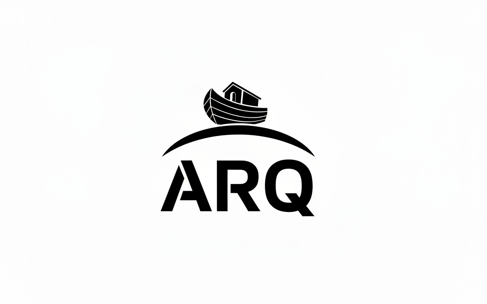

# ARQ



ARQ is an emerging front-office trading and risk platform for medium-sized banks, private banks, specialist dealers and similar institutions. It is intended to provide authoritative trading workflows and reusable, strongly typed financial libraries without the cost and rigidity of a very large vendor platform.

The initial production focus is FX spot and forwards. ARQ will own trades and positions, support four-eyes approval, use immutable local financial snapshots for deterministic calculations, and provide a web application through the C# gateway. Customer and institution functionality will normally be compiled into selected modules rather than installed as runtime financial plugins.

## Current status

ARQ is presently a foundation/prototype, not yet a complete trading platform. Implemented areas include:

- Generated C++ reference-data and market-data types.
- Reference-data commands with optimistic version checks and an audit projection.
- Kafka-backed durable update streams.
- Redis live-market projections and NATS live distribution.
- Immutable, strongly typed in-process market snapshots.
- ClickHouse reference/market storage adapters.
- SWIG-generated C# and Python bindings.
- A .NET gateway and React reference-data UI.
- A shared C++ service runtime with logging, configuration and health endpoints.

Trade capture, trade lifecycle, positions, P&L, financial pricing, risk, quoting and execution are not yet implemented.

## Documentation

- [Product vision](docs/product/vision.md) — users, goals, principles, scope and non-goals.
- [Architecture](ARCHITECTURE.md) — current shape, target boundaries and state/messaging responsibilities.
- [Roadmap](docs/roadmap/roadmap.md) — consolidated order of work and phase exit conditions.
- [Code style](CODE_STYLE.md) — conventions that supplement `.editorconfig`.
- [Agent instructions](AGENTS.md) — mandatory guidance for coding agents and contributors.

These documents distinguish implemented functionality from intended architecture. Directory names, generated schemas and technology references are not proof that a capability is operational.

## Repository map

| Path | Purpose |
|---|---|
| `ARQLib/` | C++ libraries, infrastructure abstractions and language adapters |
| `services/` | C++ reference-data and market-data services |
| `codegen/` | Canonical TOML definitions, Jinja templates and generator |
| `proto/` | Generated and supporting Protobuf schemas |
| `dotnet/` | C# SDK and HTTP gateway |
| `ui/arq-web/` | React web application |
| `infra/` | Database schemas and container definitions |
| `deploy/` | Kubernetes manifests and Kafka topic definitions |
| `tools/` | Development and messaging utilities |

## C++ build and development commands

The project uses CMake and C++23. Use the root `bld.bat` (Windows) or `bld.sh` (Linux/macOS) entry point for all normal C++ operations, including configuration, code generation, building, testing, installation, cleanup and Docker image builds. Do not invoke CMake, CTest or the scripts under `scripts/` directly unless you are maintaining the build system itself.

```powershell
# Windows
.\bld.bat <command>[d|r] [args...]
```

```bash
# Linux/macOS
./bld.sh <command>[d|r] [args...]
```

Release is the default build mode. Append `d` to select Debug or `r` to select Release explicitly. For example, `bd` is a Debug build and `tr` is an explicitly Release-mode test run. The command `d` on its own means `dockerbuild`, not Debug. Any remaining arguments are forwarded to the underlying operation.

| Operation | Command | Aliases |
|---|---|---|
| Configure | `configure` | `c` |
| Generate code | `codegen` | `g`, `cg` |
| Build | `build` | `b` |
| Run tests | `test` | `t` |
| Install | `install` | `i` |
| Clean | `clean` | `cl` |
| Build service Docker images | `dockerbuild` | `d` |
| Build the web Docker image | `dockerbuild-web` | `dw` |

Typical Windows workflow:

```powershell
.\bld.bat c       # Configure Release
.\bld.bat cg      # Run schema/code generation
.\bld.bat b       # Build Release
.\bld.bat t       # Test Release
.\bld.bat bd      # Build Debug
.\bld.bat td      # Test Debug
```

Typical Linux/macOS workflow:

```bash
./bld.sh c         # Configure Release
./bld.sh cg        # Run schema/code generation
./bld.sh b         # Build Release
./bld.sh t         # Test Release
./bld.sh bd        # Build Debug
./bld.sh td        # Test Debug
```

The .NET gateway targets .NET 10, and the web application uses npm/Vite. Their native toolchains remain separate from the C++ build entry point.

Read [AGENTS.md](AGENTS.md) before making material changes. In particular, generated files must not be edited directly and schema changes must preserve compatibility.
